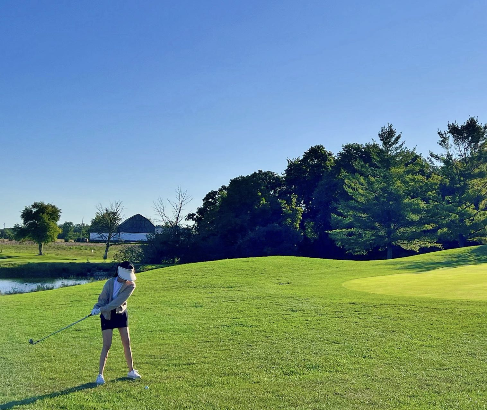
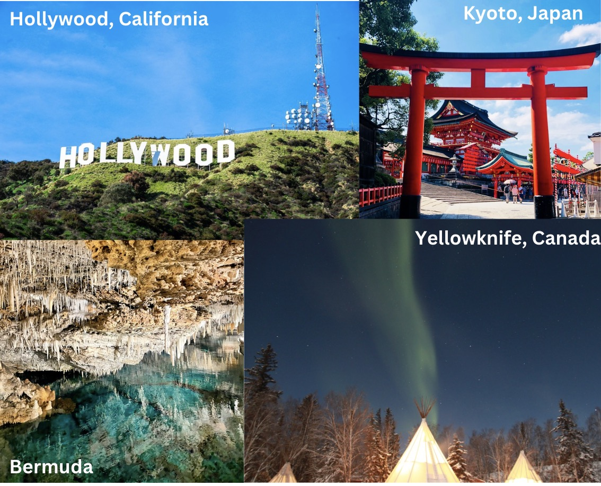

Hello! I'm Katherine, and welcome to my personal website. I'm a curious soul with a love for data science, exploring new places, and spending time with my furry best friend. My research interests lie in **cancer epidemiology**, where I work to understand how lifestyle factors influence cancer risk.

## About Me

To learn more about my academic background and professional experience, visit my [About page](about.html).

### Golf
One of my favorite activities is playing golf. I find it both challenging and relaxing, and it's a great way to spend time in the fresh air and connect with friends.

### Traveling
I absolutely love traveling! I've been fortunate enough to visit over 20 countries, experiencing new cultures, tasting delicious cuisines, and making wonderful memories. There's nothing quite like the thrill of exploring a new city or discovering a hidden gem.

### Pet Dog: Mochi 
Meet Mochi! Mochi is my 7-year-old mini schnauzer, and he's my bundle of joy. Mochi loves long walks, playing fetch, and making new friends at dog park. Everyone likes his long and beautiful eyelashes! wer~

## Contact

- **Phone**: (905) 617-8903
- **LinkedIn**: [linkedin.com/in/katherine-d-w-962b4a201](https://www.linkedin.com/in/katherine-d-w-962b4a201/)
- **Email**: [dw3093@cumc.columbia.edu](mailto:dw3093@cumc.columbia.edu)
- **GitHub**: [github.com/katherinewang0903](https://github.com/katherinewang0903)